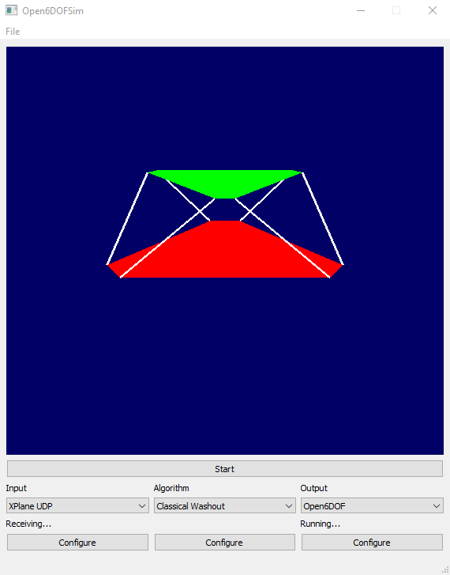

# Open6DOFSim
Open Source 6DOF motion simulator with QT-based UI

Open6DOFSim drives a hexapod motion simulator platform based on game motion data.
I built it to drive my own DIY [platform](http://robprojects.github.io).
It's a port of the [original GLUT based software](https://github.com/robprojects/flightsim-motion) to QT.

It's simple and highly extensible to support different drive algorithms, game inputs and actuator outputs.

## Setting up the platform
The File->Platform setup menu allows you to configure the geometry of your platform.

| Parameter | Dimension |
|-----------|-----------|
| Base radius/m | The radius of the fixed base in meters |
| Base separation angle/rad | The angle between two adjacent actuator mountings on the fixed base in radians |
| Platform radius/m | The radius of the motion platform in meters |
| Platform separation angle/rad | The angle between two adjacent actuator mountings on the motion platform in radians |
| Mid length/m | The length of the actuators in the centre of their travel in meters |
| Min length/m | The minimum length of the actuators in meters |
| Range/m | The range of the actuators (min to max) in meters |

Note: There is currently no way to save the settings.

## Using

The main window shows a rendering of the current position of the platform.
The Start/Stop button toggles between a standby position and running motion simulation.
Clicking the start button will cause the platform to slowly rise to a mid position, provided that there is valid data from the game.

The three combo boxes allow the input, control algorithm and output to be selected. The Configure button opens up a dialog to configure the options for the currently selected option (if any are available).

### Inputs

 * None - Provides a constant zero motion input
 * XPlane UDP - An XPlane UDP interface running on the same host

### Algorithms

 * Classical Washout - Reid/Nahon washout filtering as implemented [here](https://github.com/robprojects/flightsim-motion).
 * Manual position - Allows the platform position to be manually adjusted in six degrees of freedom.

### Outputs

 * None - No output (just render to the screen)
 * Open6DOF - My own actuator design, using the serial protocol described [here](https://github.com/robprojects/flightsim-motion).

## Building

Requires [Visual Studio 2019](https://visualstudio.microsoft.com/downloads/), [QT Visual Studio Tools](https://doc.qt.io/qtvstools/index.html) and [QT](https://www.qt.io/download-open-source).

## Development

In the current state, you will probably need to modify the code and recompile in order to meet your needs, for example to support a game other than XPlane or your own actuator.
Adding new Inputs, Outputs or Algorithms is straightforward. You need to subclass the Input, Output or Algorithm abstract classes respectively and reimplement the virtual methods.

## License

Copyright 2020 Rob Dimond
Licensed under the GNU General Public License, Version 3.0